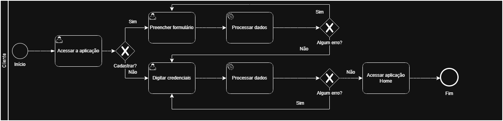
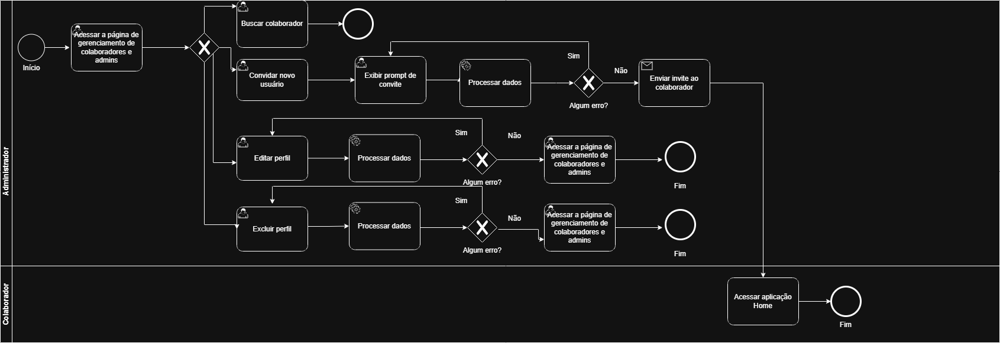

# 3.3.1 Processo 1 – GESTÃO DE USUÁRIO

O processo de **Gestão de Usuário** permite o cadastro, acesso e manutenção das informações de colaboradores e clientes da empresa. O fluxo de atividades ocorre de acordo com o papel de cada usuário no sistema:  
* Cliente: Acessa a aplicação web e decide se deseja realizar login com credenciais existentes ou registrar uma nova conta, preenchendo seus dados pessoais e de endereço.  
* Administrador: Acessa as páginas de gerenciamento para controlar o acesso ao sistema. Ele pode visualizar as listas de colaboradores e clientes, buscar perfis específicos, editar informações cadastrais, excluir contas e convidar novos colaboradores enviando um link de acesso por e-mail.  
* Usuário Convidado (Colaborador): Recebe o convite enviado pelo administrador, acessa o link e completa o seu cadastro preenchendo os dados restantes exigidos pelo sistema.  

## Oportunidades de melhoria

A informatização do processo de Gestão de Usuário traz as seguintes oportunidades de melhoria:

• centralização das informações cadastrais em um único sistema;

• redução de erros decorrentes de controles manuais;

• facilidade para localizar e atualizar dados dos profissionais;

• integração com processos de agendamento, serviços e comissão;

• maior segurança no acesso às informações;

• melhor rastreabilidade das alterações realizadas no cadastro.

## Modelagem
Em seguida, apresentam-se os modelos do processo de Gestão de Usuário, descritos no padrão BPMN:

### Descrições Detalhadas Alinhadas aos Wireframes

O processo se inicia com o usuário acessando a aplicação através da tela de login, onde o usuário tem duas opções de ação baseadas nos wireframes: utilizar os campos **"Login"** e **"Senha"** para inserir credenciais já existentes e clicar no botão **"Entrar"**, ou clicar no link **Criar conta** caso seja um novo usuário. 
Optando por **"Criar conta"**, o sistema o redireciona para a tela de **Cadastro**. Já ao clicar em **"Entrar"**, o sistema processa a autenticação e, sendo bem-sucedida, concede o acesso. Se as credenciais forem inválidas, um prompt de erro exibe a mensagem *"Usuário ou senha inválidos"* na própria tela, permitindo uma nova tentativa.
Na tela de **"Cadastro"**, o usuário visualiza um formulário e pode preencher seus dados (Nome completo, E-mail, Telefone, Data de nascimento, CPF, CEP, Logradouro, Número, Complemento, Bairro, Cidade, UF, Senha e Confirmar senha).  

Após o preenchimento, o usuário pressiona o botão **"Cadastrar"** para finalizar a criação da conta. Caso o usuário já possua uma conta e tenha acessado a tela por engano, ele pode utilizar o comando **"Já tem uma conta? Fazer login"** para retornar à tela inicial. Após o cadastro bem-sucedido, ele recebe um aviso de sucesso e retorna ao login.  

### Detalhamento das atividades

#### Digitar credenciais

| **Campo** | **Tipo**       | **Restrições** | **Valor padrão** |
| --------- | -------------- | -------------- | ---------------- |
| Login    | Caixa de texto | obrigatório    | vazio            |
| Senha     | Caixa de texto | obrigatório    | vazio            |

| **Comandos** | **Destino**                        | **Tipo** |
| ------------ | ---------------------------------- | -------- |
| Entrar       | Atividade "Acessar meus agendamentos"    | padrão   |
| Criar conta    | Atividade "Criar conta"       | padrão   |

| **Resultado**       | **Destino**     |
| ------------------- | --------------- |
| Sessão criada     | Atividade "Acessar meus agendamentos" |
| Prompt de erro    | "Usuário ou senha inválidos." |

### Wireframes

---

---

#### Preencher formulário

| **Campo**          | **Tipo**       | **Restrições**       | **Valor padrão** |
| ------------------ | -------------- | -------------------- | ---------------- |
| Nome completo      | Caixa de texto | obrigatório          | vazio            |
| E-mail             | Caixa de texto | obrigatório e único; deve ter formato válido  | vazio            |
| Telefone           | Caixa de texto | obrigatório; deve ter formato válido          | vazio            |
| Data de nascimento | Data           | obrigatório; deve ter formato válido         | vazio            |
| CPF                | Caixa de texto | obrigatório e único  | vazio            |
| CEP                | Caixa de texto | obrigatório; deve ter formato válido         | vazio            |
| Logradouro         | Caixa de texto | obrigatório          | vazio            |
| Número             | Caixa de texto | obrigatório          | vazio            |
| Complemento        | Caixa de texto | obrigatório          | vazio            |
| Bairro             | Caixa de texto | obrigatório          | vazio            |
| Cidade             | Caixa de texto | obrigatório          | vazio            |
| UF                 | Seleção única  | obrigatório          | vazio            |
| Senha              | Caixa de texto | obrigatório          | vazio            |
| Confirmar senha    | Caixa de texto | obrigatório; deve ser igual ao campo senha | vazio |

| **Comandos**  | **Destino**                       | **Tipo** |
| ------------- | --------------------------------- | -------- |
| Cadastrar Cliente     | Atividade "Acessar a aplicação"   | padrão   |
| Fazer login   | Atividade "Acessar a aplicação"     | padrão |

| **Resultado**        | **Destino**                          |
| -------------------- | ------------------------------------ |
| Cadastro realizado  | Toast "Cadastro realizado com sucesso." e Atividade "Acessar a aplicação"  |
| Prompt de erro    | "Campo inválido." |

### Wireframes

---

## Gerenciar Colaboradores

## Modelagem
Em seguida, apresentam-se o modelo do processo de Gestão de Usuário, descrito no padrão BPMN:

### Descrições Detalhadas Alinhadas aos Wireframes

O processo se inicia com administrador acessando a tela **"Gerenciar Colaboradores"** para controlar a equipe. A interface apresenta uma listagem com Nome, Email, Cargo, Status e Ações. 

A partir dessa tela, o administrador tem quatro ações principais:
* **Buscar colaborador:** Ele pode utilizar o campo **"Buscar colaboradores"** para filtrar a lista.  
* **Convidar novo usuário:** Ao clicar no botão **"Convidar"**, abre-se o modal **"Convidar Colaborador"**, onde ele preenche o *"Email do colaborador"*, seleciona o *"Cargo"* e utiliza o botão **"Enviar Convite"**. O usuário que recebeu o convite acessa o link e é direcionado para a tela **"Cadastrar Cliente"** onde completa seu cadastro retornando ao processo de usuário.   
* **Editar perfil:** Ao clicar no ícone de **lápis** (na coluna Ações), um modal é aberto com os dados atuais preenchidos para alteração, confirmando a ação no botão **"Salvar"**.  
* **Excluir perfil:** Ao clicar no ícone de **lixeira**, o sistema exibe um prompt de exclusão, confirmando a ação no botão **"Excluir"**.  

Todas as ações em modais podem ser abortadas clicando no botão **"Cancelar"** ou no **"X"**.  

### Detalhamento das atividades

#### Buscar colaborador

| **Campo**         | **Tipo**       | **Restrições**                        | **Valor padrão** |
| ----------------- | -------------- | ------------------------------------- | ---------------- |
| Buscar colaboradores           | Caixa de texto | vazio  | vazio            |

| **Comandos** | **Destino**                                   | **Tipo** |
| ---          | ---                                           | -------- |
| Convidar     | Atividade "Convidar novo usuário"          | padrão   |
| Editar (lápis)       | Atividade "Editar perfil"   | padrão   |
| Excluir (lixeira)      | Atividade "Excluir perfil" | padrão   |

| **Resultado**       | **Destino**     |
| ------------------- | --------------- |
| Colaborador encontrado     | Colaborador filtrado. |
| Modal convite     | Atividade "Convidar novo usuário" |
| Modal edição     | Atividade "Editar perfil" |
| Modal exclusão    | Atividade "Excluir perfil" |

---

#### Convidar novo usuário

| **Campo**         | **Tipo**       | **Restrições**                        | **Valor padrão** |
| ----------------- | -------------- | ------------------------------------- | ---------------- |
| E-mail do colaborador           | Caixa de texto | obrigatório; deve ter formato válido  | vazio            |
| Cargo  | Seleção única  | Cabeleireiro/Manicure/Atendente/Gerente                   | vazio      |
| Nível de acesso  | Seleção única  | Admin/Colaborador                   | vazio      |

| **Comandos**          | **Destino**                              | **Tipo** |
| --------------------- | ---------------------------------------- | -------- |
| Enviar Convite | Atividade "Exibir prompt de convite" | padrão |
| Cancelar              | Atividade "Acessar a página de gerenciamento de colaboradores e admins"     | cancelar |

| **Resultado**        | **Destino**                          |
| -------------------- | ------------------------------------ |
| Convite enviado  | Atividade "Exibir prompt de convite"   |
| Mensagem | "Não foi possível enviar o convite. Tente novamente."   |
| Operação cancelada  | Atividade "Acessar a página de gerenciamento de colaboradores e admins"   |

---

#### Exibir prompt de convite

| **Campo**          | **Tipo** | **Restrições**  | **Valor padrão**              |
| ------------------ | -------- | --------------- | ----------------------------- |
| Prompt de convite  | Exibição | somente leitura | padrão      |

| **Comandos**          | **Destino**                              | **Tipo** |
| --------------------- | ---------------------------------------- | -------- |
| "X" (Fechar)             | Atividade "Acessar a página de gerenciamento de colaboradores e admins"     | padrão |

| **Resultado**        | **Destino**                          |
| -------------------- | ------------------------------------ |
| Modal de convite fechado  | Atividade "Acessar a página de gerenciamento de colaboradores e admins"   |

---

#### Editar perfil

| **Campo**         | **Tipo**       | **Restrições**                        | **Valor padrão** |
| ----------------- | -------------- | ------------------------------------- | ---------------- |
| E-mail do colaborador           | Caixa de texto | obrigatório; deve ter formato válido  | atual preenchido            |
| Cargo  | Seleção única  | Cabelereiro/Manicure/Atendente/Gerente                   | atual preenchido      |
| Nível de acesso  | Seleção única  | Admin/Colaborador                   | atual preenchido      |

| **Comandos**          | **Destino**                              | **Tipo** |
| --------------------- | ---------------------------------------- | -------- |
| Salvar | Atividade "Acessar a página de gerenciamento de colaboradores e admins" | padrão |
| Cancelar              | Atividade "Acessar a página de gerenciamento de colaboradores e admins"     | cancelar |

| **Resultado**        | **Destino**                          |
| -------------------- | ------------------------------------ |
| Usuário alterado  | Toast de "Usuário alterado com sucesso" e Atividade "Acessar a página de gerenciamento de colaboradores e admins"   |
| Mensagem | "Não foi possível salvar alteração. Tente novamente."   |
| Operação cancelada  | Atividade "Acessar a página de gerenciamento de colaboradores e admins"   |

---

#### Excluir perfil

| **Campo**          | **Tipo** | **Restrições**  | **Valor padrão**              |
| ------------------ | -------- | --------------- | ----------------------------- |
| Prompt de exclusão  | Exibição | somente leitura | padrão      |

| **Comandos**          | **Destino**                              | **Tipo** |
| --------------------- | ---------------------------------------- | -------- |
| Excluir | Atividade "Acessar a página de gerenciamento de colaboradores e admins" | padrão |
| Cancelar              | Atividade "Acessar a página de gerenciamento de colaboradores e admins"     | cancelar |

| **Resultado**        | **Destino**                          |
| -------------------- | ------------------------------------ |
| Usuário excluído  | Toast de "Usuário excluído com sucesso" e Atividade "Acessar a página de gerenciamento de colaboradores e admins"   |
| Operação cancelada  | Atividade "Acessar a página de gerenciamento de colaboradores e admins"   |

#### Wireframe

---

---

#### Preencher formulário

| **Campo**       | **Tipo**       | **Restrições**                              | **Valor padrão** |
| --------------- | -------------- | ------------------------------------------- | ---------------- |
| Nome completo      | Caixa de texto | obrigatório          | vazio            |
| E-mail             | Caixa de texto | obrigatório e único; deve ter formato válido  | vazio            |
| Telefone           | Caixa de texto | obrigatório; deve ter formato válido          | vazio            |
| Data de nascimento | Data           | obrigatório; deve ter formato válido         | vazio            |
| CPF                | Caixa de texto | obrigatório e único  | vazio            |
| CEP                | Caixa de texto | obrigatório; deve ter formato válido         | vazio            |
| Logradouro         | Caixa de texto | obrigatório          | vazio            |
| Número             | Caixa de texto | obrigatório          | vazio            |
| Complemento        | Caixa de texto | obrigatório          | vazio            |
| Bairro             | Caixa de texto | obrigatório          | vazio            |
| Cidade             | Caixa de texto | obrigatório          | vazio            |
| UF                 | Seleção única  | obrigatório          | vazio            |
| Senha              | Caixa de texto | obrigatório          | vazio            |
| Confirmar senha    | Caixa de texto | obrigatório; deve ser igual ao campo senha | vazio |

| **Comandos**  | **Destino**                       | **Tipo** |
| ------------- | --------------------------------- | -------- |
| Cadastrar     | Atividade "Acessar a aplicação"   | padrão   |

| **Resultado**        | **Destino**                          |
| -------------------- | ------------------------------------ |
| Cadastro realizado  | Toast "Cadastro realizado com sucesso." e Atividade "Acessar a aplicação"  |
| Prompt de erro    | "Campo inválido." |
 
### Wireframes

