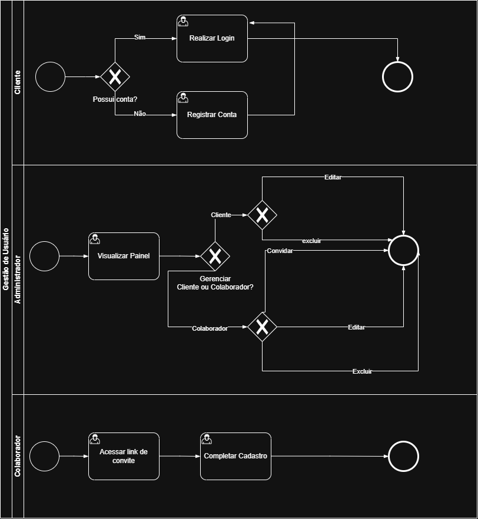
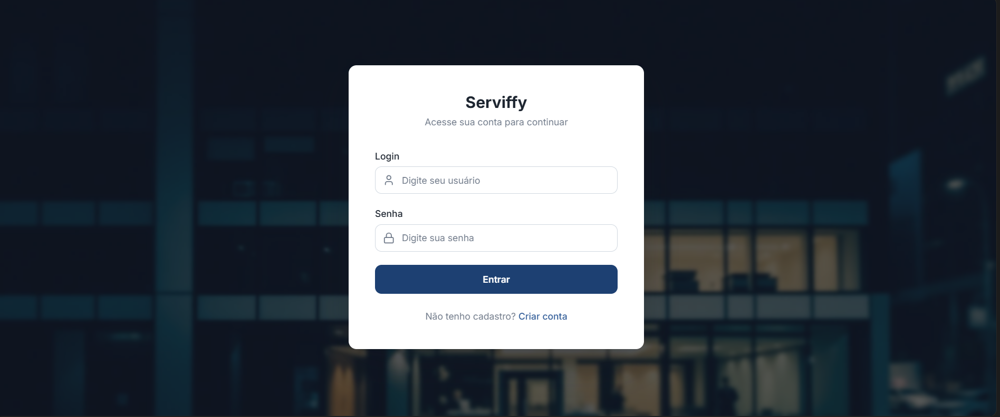
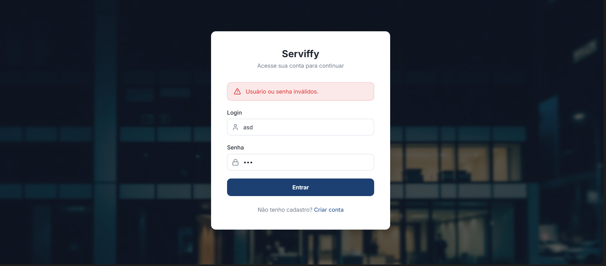
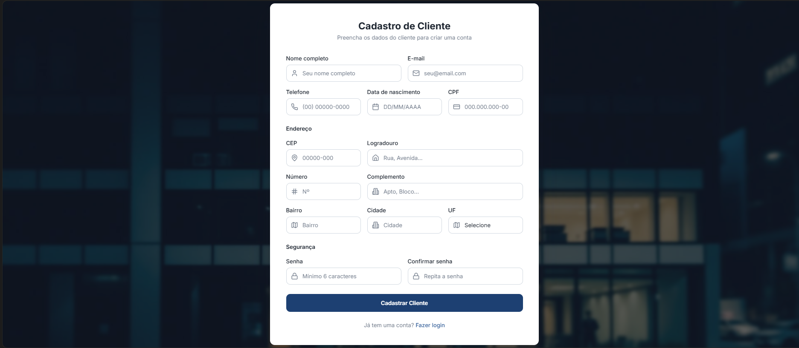
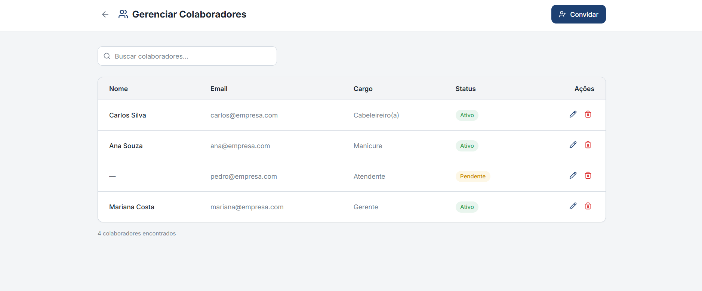
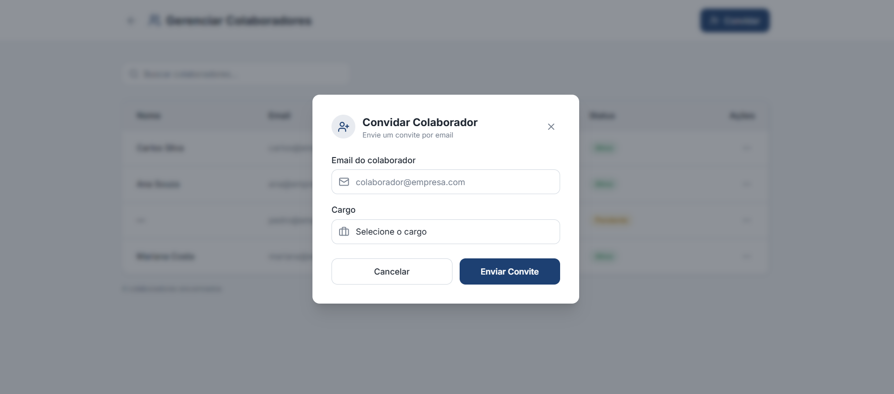
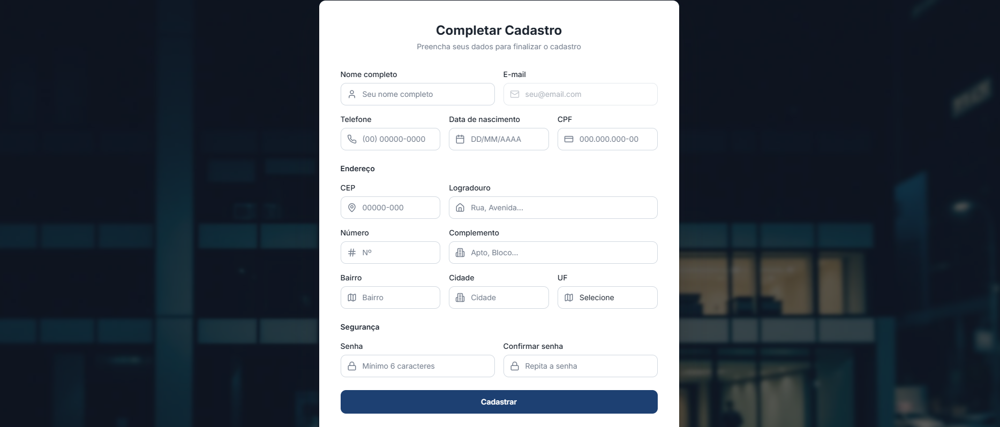
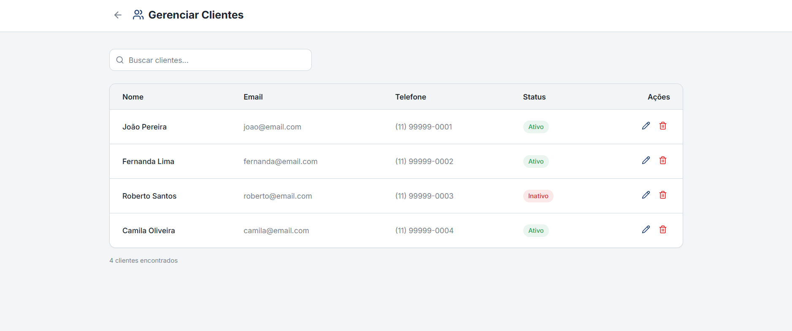

# 3.3.1 Processo 1 – GESTÃO DE USUÁRIO

O processo de **Gestão de Usuário** permite o cadastro, acesso e manutenção das informações de colaboradores e clientes da empresa. O fluxo de atividades ocorre de acordo com o papel de cada usuário no sistema:  
* Cliente: Acessa a aplicação web e decide se deseja realizar login com credenciais existentes ou registrar uma nova conta, preenchendo seus dados pessoais e de endereço.  
* Administrador: Acessa as páginas de gerenciamento para controlar o acesso ao sistema. Ele pode visualizar as listas de colaboradores e clientes, buscar perfis específicos, editar informações cadastrais, excluir contas e convidar novos colaboradores enviando um link de acesso por e-mail.  
* Usuário Convidado (Colaborador): Recebe o convite enviado pelo administrador, acessa o link e completa o seu cadastro preenchendo os dados restantes exigidos pelo sistema.  

## Oportunidades de melhoria

A informatização do processo de Gestão de Usuário traz as seguintes oportunidades de melhoria:

• centralização das informações cadastrais em um único sistema;

• redução de erros decorrentes de controles manuais;

• facilidade para localizar e atualizar dados dos profissionais;

• integração com processos de agendamento, serviços e comissão;

• maior segurança no acesso às informações;

• melhor rastreabilidade das alterações realizadas no cadastro.

## Modelagem
Em seguida, apresentam-se os modelos do processo de Gestão de Usuário, descritos no padrão BPMN:

### Descrições Detalhadas Alinhadas aos Wireframes

#### Autenticação de Cliente
A etapa de autenticação tem como objetivo permitir que um cliente acesse o sistema. O fluxo inicia na tela de login, onde o cliente possui duas opções de ação baseadas nos wireframes: utilizar os campos "Login" e "Senha" para inserir credenciais já existentes e clicar no botão "Entrar", ou clicar no link "Criar conta" caso seja um novo usuário.

Ao selecionar a opção "Criar conta", o sistema redireciona o usuário para a tela de Cadastro de Cliente. Já ao clicar em "Entrar", o sistema processa a autenticação e, sendo bem-sucedida, concede acesso ao sistema. Caso as credenciais estejam incorretas, o sistema exibe um alerta visual com a mensagem "Usuário ou senha inválidos.", permitindo uma nova tentativa de login.

### Detalhamento das atividades

#### Acessar a aplicação

| **Campo** | **Tipo**       | **Restrições** | **Valor padrão** |
| --------- | -------------- | -------------- | ---------------- |
| Login     | Caixa de texto | obrigatório    | vazio            |
| Senha     | Caixa de texto | obrigatório    | vazio            |

| **Comandos** | **Destino**                | **Tipo** |
| ------------ | -------------------------- | -------- |
| Entrar       | Área interna da plataforma | padrão   |
| Criar conta  | Atividade "Criar conta"    | padrão   |

| **Resultado**               | **Destino**                   |
| --------------------------- | ----------------------------- |
| Login realizado com sucesso | Área interna da plataforma    |
| Prompt de erro              | "Usuário ou senha inválidos." |

### Wireframes

---

---

## Registro de Cliente

O registro tem como objetivo coletar as informações de um novo usuário. Na tela "Cadastro de Cliente", o usuário visualiza um formulário e pode preencher seus dados.

Após o preenchimento, o usuário pressiona o botão "Cadastrar Cliente" para finalizar a criação da conta. Caso o usuário já possua uma conta e tenha acessado a tela por engano, ele pode utilizar o comando "Já tem uma conta? Fazer login" para retornar à tela inicial.

Após o cadastro realizado com sucesso, o sistema exibe uma mensagem de confirmação e redireciona o usuário para a tela de login.

### Detalhamento das atividades

#### Preencher formulário

| **Campo**          | **Tipo**       | **Restrições**                               | **Valor padrão** |
| ------------------ | -------------- | -------------------------------------------- | ---------------- |
| Nome completo      | Caixa de texto | obrigatório                                  | vazio            |
| E-mail             | Caixa de texto | obrigatório e único; deve ter formato válido | vazio            |
| Telefone           | Caixa de texto | obrigatório; deve ter formato válido         | vazio            |
| Data de nascimento | Data           | obrigatório; deve ter formato válido         | vazio            |
| CPF                | Caixa de texto | obrigatório e único                          | vazio            |
| CEP                | Caixa de texto | obrigatório; deve ter formato válido         | vazio            |
| Logradouro         | Caixa de texto | obrigatório                                  | vazio            |
| Número             | Caixa de texto | obrigatório                                  | vazio            |
| Complemento        | Caixa de texto | opcional                                     | vazio            |
| Bairro             | Caixa de texto | obrigatório                                  | vazio            |
| Cidade             | Caixa de texto | obrigatório                                  | vazio            |
| UF                 | Seleção única  | obrigatório                                  | vazio            |
| Senha              | Caixa de texto | obrigatório                                  | vazio            |
| Confirmar senha    | Caixa de texto | obrigatório; deve ser igual ao campo senha   | vazio            |

| **Comandos**      | **Destino**                     | **Tipo** |
| ----------------- | ------------------------------- | -------- |
| Cadastrar Cliente | Atividade "Acessar a aplicação" | padrão   |
| Fazer login       | Tela de autenticação            | padrão   |

| **Resultado**      | **Destino**                                                               |
| ------------------ | ------------------------------------------------------------------------- |
| Cadastro realizado | Toast "Cadastro realizado com sucesso." e Atividade "Acessar a aplicação" |
| Prompt de erro     | "Campo inválido."                                                         |

### Wireframes

---

## Gerenciar Colaboradores

O administrador acessa a tela **"Gerenciar Colaboradores"** para controlar a equipe. A interface apresenta uma listagem com Nome, Email, Cargo, Status e Ações. Ele pode utilizar o campo **"Buscar colaboradores"** para filtrar a lista.  

A partir dessa tela, o administrador tem três ações principais:
* **Convidar:** Ao clicar no botão **"Convidar"**, abre-se o modal **"Convidar Colaborador"**, onde ele preenche o *"Email do colaborador"*, seleciona o *"Cargo"* e utiliza o botão **"Enviar Convite"**.  
* **Editar:** Ao clicar no ícone de **lápis** (na coluna Ações), um modal é aberto com os dados atuais preenchidos para alteração, confirmando a ação no botão **"Salvar"**.  
* **Excluir:** Ao clicar no ícone de **lixeira**, o sistema exibe um prompt de exclusão, confirmando a ação no botão **"Excluir"**.  

Todas as ações em modais podem ser abortadas clicando no botão **"Cancelar"** ou no **"X"**.  

### Detalhamento das atividades

#### Acessar a página de gerenciamento de colaboradores e admins

| **Campo**            | **Tipo**       | **Restrições** | **Valor padrão** |
| -------------------- | -------------- | -------------- | ---------------- |
| Buscar colaboradores | Caixa de texto | vazio          | vazio            |

| **Comandos**      | **Destino**                       | **Tipo** |
| ----------------- | --------------------------------- | -------- |
| Convidar          | Atividade "Convidar novo usuário" | padrão   |
| Editar (lápis)    | Atividade "Editar perfil"         | padrão   |
| Excluir (lixeira) | Atividade "Excluir perfil"        | padrão   |

| **Resultado**          | **Destino**                       |
| ---------------------- | --------------------------------- |
| Colaborador encontrado | Colaborador filtrado              |
| Modal convite          | Atividade "Convidar novo usuário" |
| Modal edição           | Atividade "Editar perfil"         |
| Modal exclusão         | Atividade "Excluir perfil"        |

---

#### Convidar novo usuário

| **Campo**         | **Tipo**       | **Restrições**                        | **Valor padrão** |
| ----------------- | -------------- | ------------------------------------- | ---------------- |
| E-mail do colaborador           | Caixa de texto | obrigatório; deve ter formato válido  | vazio            |
| Cargo  | Seleção única  | Cabeleireiro/Manicure/Atendente/Gerente                   | vazio      |
| Nível de acesso  | Seleção única  | Admin/Colaborador                   | vazio      |

| **Comandos**          | **Destino**                              | **Tipo** |
| --------------------- | ---------------------------------------- | -------- |
| Enviar Convite | Atividade "Exibir prompt de convite" | padrão |
| Cancelar              | Atividade "Acessar a página de gerenciamento de colaboradores e admins"     | cancelar |

| **Resultado**        | **Destino**                          |
| -------------------- | ------------------------------------ |
| Convite enviado  | Atividade "Exibir prompt de convite"   |
| Mensagem | "Não foi possível enviar o convite. Tente novamente."   |
| Operação cancelada  | Atividade "Acessar a página de gerenciamento de colaboradores e admins"   |

---

#### Exibir prompt de convite

| **Campo**          | **Tipo** | **Restrições**  | **Valor padrão**              |
| ------------------ | -------- | --------------- | ----------------------------- |
| Prompt de convite  | Exibição | somente leitura | padrão      |

| **Comandos**          | **Destino**                              | **Tipo** |
| --------------------- | ---------------------------------------- | -------- |
| "X" (Fechar)             | Atividade "Acessar a página de gerenciamento de colaboradores e admins"     | padrão |

| **Resultado**        | **Destino**                          |
| -------------------- | ------------------------------------ |
| Modal de convite fechado  | Atividade "Acessar a página de gerenciamento de colaboradores e admins"   |

---

#### Editar perfil

| **Campo**         | **Tipo**       | **Restrições**                        | **Valor padrão** |
| ----------------- | -------------- | ------------------------------------- | ---------------- |
| E-mail do colaborador           | Caixa de texto | obrigatório; deve ter formato válido  | atual preenchido            |
| Cargo  | Seleção única  | Cabelereiro/Manicure/Atendente/Gerente                   | atual preenchido      |
| Nível de acesso  | Seleção única  | Admin/Colaborador                   | atual preenchido      |

| **Comandos**          | **Destino**                              | **Tipo** |
| --------------------- | ---------------------------------------- | -------- |
| Salvar | Atividade "Acessar a página de gerenciamento de colaboradores e admins" | padrão |
| Cancelar              | Atividade "Acessar a página de gerenciamento de colaboradores e admins"     | cancelar |

| **Resultado**        | **Destino**                          |
| -------------------- | ------------------------------------ |
| Usuário alterado  | Toast de "Usuário alterado com sucesso" e Atividade "Acessar a página de gerenciamento de colaboradores e admins"   |
| Mensagem | "Não foi possível salvar alteração. Tente novamente."   |
| Operação cancelada  | Atividade "Acessar a página de gerenciamento de colaboradores e admins"   |

---

#### Excluir perfil

| **Campo**          | **Tipo** | **Restrições**  | **Valor padrão**              |
| ------------------ | -------- | --------------- | ----------------------------- |
| Prompt de exclusão  | Exibição | somente leitura | padrão      |

| **Comandos**          | **Destino**                              | **Tipo** |
| --------------------- | ---------------------------------------- | -------- |
| Excluir | Atividade "Acessar a página de gerenciamento de colaboradores e admins" | padrão |
| Cancelar              | Atividade "Acessar a página de gerenciamento de colaboradores e admins"     | cancelar |

| **Resultado**        | **Destino**                          |
| -------------------- | ------------------------------------ |
| Usuário excluído  | Toast de "Usuário excluído com sucesso" e Atividade "Acessar a página de gerenciamento de colaboradores e admins"   |
| Operação cancelada  | Atividade "Acessar a página de gerenciamento de colaboradores e admins"   |

#### Wireframe

---

---

### Registro de Usuário Convidado

O usuário que recebeu o convite acessa o link e é direcionado para a tela **"Completar Cadastro"**. A interface exibe os campos restantes para a ativação do perfil (Nome completo, Telefone, Data de nascimento, CPF, Endereço completo, Senha e Confirmar senha).  

Após o preenchimento, o usuário clica no botão **"Cadastrar"**. Em caso de sucesso, o cadastro é concluído e o acesso ao sistema é liberado.  

### Detalhamento das atividades

#### Preencher formulário

| **Campo**       | **Tipo**       | **Restrições**                              | **Valor padrão** |
| --------------- | -------------- | ------------------------------------------- | ---------------- |
| Nome completo      | Caixa de texto | obrigatório          | vazio            |
| E-mail             | Caixa de texto | obrigatório e único; deve ter formato válido  | vazio            |
| Telefone           | Caixa de texto | obrigatório; deve ter formato válido          | vazio            |
| Data de nascimento | Data           | obrigatório; deve ter formato válido         | vazio            |
| CPF                | Caixa de texto | obrigatório e único  | vazio            |
| CEP                | Caixa de texto | obrigatório; deve ter formato válido         | vazio            |
| Logradouro         | Caixa de texto | obrigatório          | vazio            |
| Número             | Caixa de texto | obrigatório          | vazio            |
| Complemento        | Caixa de texto | obrigatório          | vazio            |
| Bairro             | Caixa de texto | obrigatório          | vazio            |
| Cidade             | Caixa de texto | obrigatório          | vazio            |
| UF                 | Seleção única  | obrigatório          | vazio            |
| Senha              | Caixa de texto | obrigatório          | vazio            |
| Confirmar senha    | Caixa de texto | obrigatório; deve ser igual ao campo senha | vazio |

| **Comandos**  | **Destino**                       | **Tipo** |
| ------------- | --------------------------------- | -------- |
| Cadastrar     | Atividade "Acessar a aplicação"   | padrão   |

| **Resultado**        | **Destino**                          |
| -------------------- | ------------------------------------ |
| Cadastro realizado  | Toast "Cadastro realizado com sucesso." e Atividade "Acessar a aplicação"  |
| Prompt de erro    | "Campo inválido." |
 
### Wireframes

## Gerenciar Clientes

Na tela **"Gerenciar Clientes"**, o administrador visualiza a lista de usuários (com Nome, Email, Telefone, Status e Ações) e pode usar o campo **"Buscar cliente..."** para filtros.  

Na coluna de Ações, o administrador pode clicar no ícone de **lápis** para editar as informações (confirmando no botão **"Salvar"**) ou no ícone de **lixeira** para deletar a conta (confirmando no botão **"Excluir"**). As ações nos modais podem ser interrompidas pelo botão **"Cancelar"**.
### Detalhamento das atividades

#### Acessar a página de gerenciamento de clientes

| **Campo**         | **Tipo**       | **Restrições**                        | **Valor padrão** |
| ----------------- | -------------- | ------------------------------------- | ---------------- |
| Buscar clientes           | Caixa de texto | vazio  | vazio            |

| **Comandos** | **Destino**                                   | **Tipo** |
| ---          | ---                                           | -------- |
| Editar (lápis)       | Atividade "Editar perfil"   | padrão   |
| Excluir (lixeira)      | Atividade "Excluir perfil" | padrão   |

| **Resultado**       | **Destino**     |
| ------------------- | --------------- |
| Cliente encontrado     | Cliente filtrado. |
| Modal edição     | Atividade "Editar perfil" |
| Modal exclusão    | Atividade "Excluir perfil" |

---

#### Editar perfil

| **Campo**       | **Tipo**       | **Restrições**                              | **Valor padrão** |
| --------------- | -------------- | ------------------------------------------- | ---------------- |
| Nome completo      | Caixa de texto | obrigatório          | atual preenchido            |
| E-mail             | Caixa de texto | obrigatório e único; deve ter formato válido  | atual preenchido            |
| Telefone           | Caixa de texto | obrigatório; deve ter formato válido          | atual preenchido            |
| Data de nascimento | Data           | obrigatório; deve ter formato válido         | atual preenchido            |
| CPF                | Caixa de texto | obrigatório e único  | atual preenchido            |
| CEP                | Caixa de texto | obrigatório; deve ter formato válido         | atual preenchido            |
| Logradouro         | Caixa de texto | obrigatório          | atual preenchido            |
| Número             | Caixa de texto | obrigatório          | atual preenchido            |
| Complemento        | Caixa de texto | obrigatório          | atual preenchido            |
| Bairro             | Caixa de texto | obrigatório          | atual preenchido            |
| Cidade             | Caixa de texto | obrigatório          | atual preenchido            |
| UF                 | Seleção única  | obrigatório          | atual preenchido            |

| **Comandos**          | **Destino**                              | **Tipo** |
| --------------------- | ---------------------------------------- | -------- |
| Salvar | Atividade "Acessar a página de gerenciamento de clientes" | padrão |
| Cancelar              | Atividade "Acessar a página de gerenciamento de clientes"     | cancelar |

| **Resultado**        | **Destino**                          |
| -------------------- | ------------------------------------ |
| Cliente alterado  | Toast de "Usuário alterado com sucesso" e Atividade "Acessar a página de gerenciamento de clientes"   |
| Mensagem | "Não foi possível salvar alteração. Tente novamente."   |
| Operação cancelada  | Atividade "Acessar a página de gerenciamento de clientes"   |

---

#### Excluir perfil

| **Campo**          | **Tipo** | **Restrições**  | **Valor padrão**              |
| ------------------ | -------- | --------------- | ----------------------------- |
| Prompt de exclusão  | Exibição | somente leitura | padrão      |

| **Comandos**          | **Destino**                              | **Tipo** |
| --------------------- | ---------------------------------------- | -------- |
| Excluir | Atividade "Acessar a página de gerenciamento de clientes" | padrão |
| Cancelar              | Atividade "Acessar a página de gerenciamento de clientes"     | cancelar |

| **Resultado**        | **Destino**                          |
| -------------------- | ------------------------------------ |
| Cliente excluído  | Toast de "Acessar a página de gerenciamento de clientes"   |
| Operação cancelada  | Atividade "Acessar a página de gerenciamento de clientes"   |

------------------------

### Wireframes

