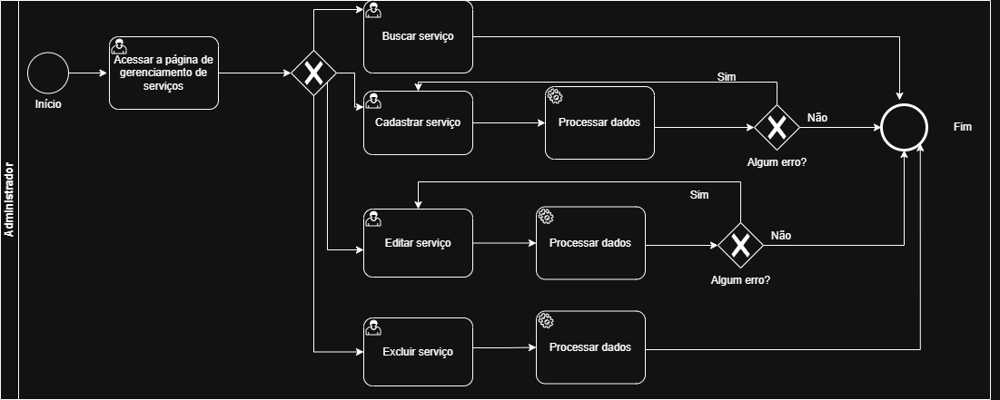
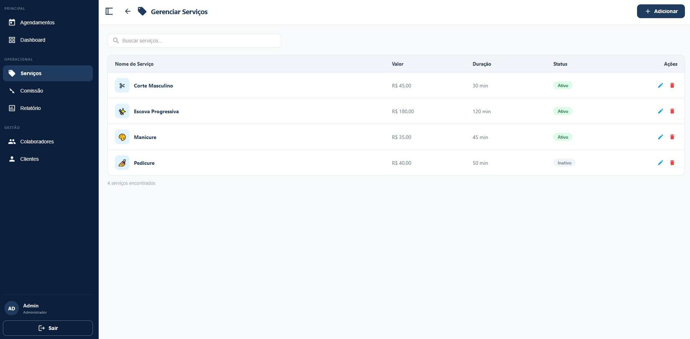
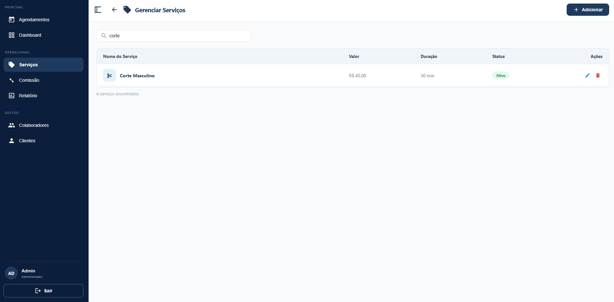
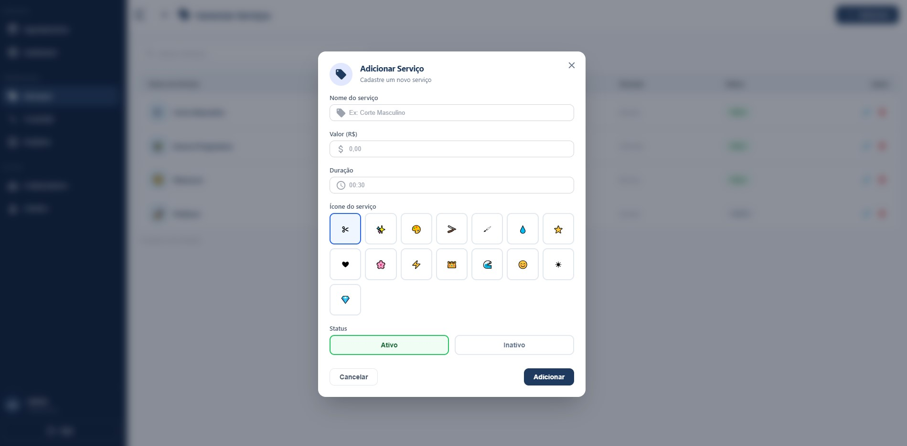
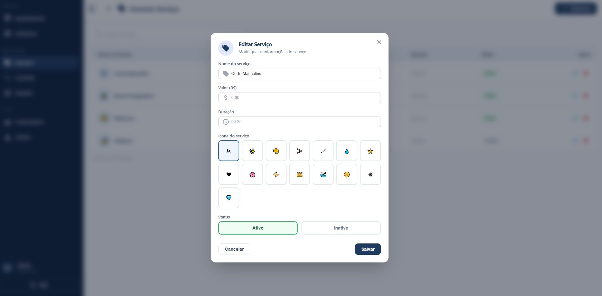
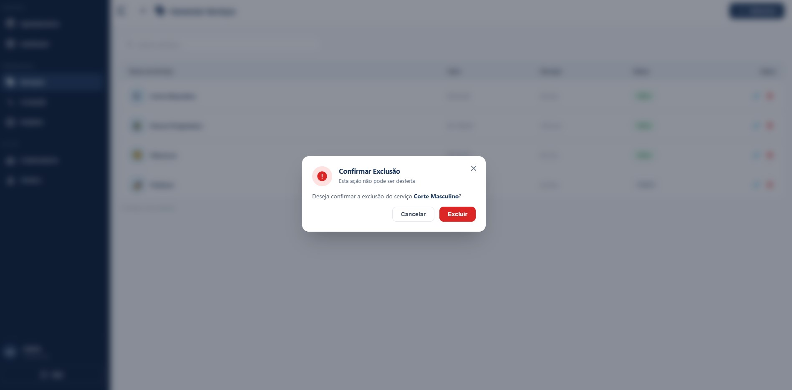

# 3.3.2 Processo 2 – GESTÃO DE SERVIÇO

O processo de **Gestão de Serviço** tem como objetivo permitir o cadastro e manutenção das informações relacionados aos serviços prestados pela empresa. O cadastro de serviços permite que eles sejam exibidos a todos os clientes com informações padronizadas e estruturadas, além de permitir que colaboradores tenham a facilidade de registrar o leque de serviços que estão aptos a prestar.

## Oportunidades de melhoria

A informatização do processo de Gestão de Serviço traz as seguintes oportunidades de melhoria:

• padronização dos serviços oferecidos pela empresa, evitando inconsistências na descrição, duração e valores;

• centralização das informações dos serviços em um único sistema, facilitando o acesso e a manutenção dos dados;

• redução de erros operacionais decorrentes do uso de controles manuais ou planilhas;

• facilidade na atualização de valores e duração dos serviços, permitindo maior flexibilidade na gestão do negócio;

• integração com o processo de agendamento, garantindo que os horários sejam definidos corretamente com base na duração dos serviços;

• apoio ao cálculo automático de comissões, uma vez que os serviços estarão previamente cadastrados com seus respectivos valores;

• melhoria na organização e no controle do portfólio de serviços oferecidos pela empresa;

• maior agilidade no atendimento ao cliente, uma vez que os serviços já estarão estruturados no sistema;

• aumento da confiabilidade das informações utilizadas nos processos financeiros e operacionais.

## Modelagem

Em seguida, apresenta-se o modelo do processo de Gestão de Serviço, descrito no padrão BPMN:

## Processo Gestão de Serviço

O processo de **Gestão de Serviço** se inicia com o administrador acessando a tela de gerenciamento de serviços em que se apresenta a relação de todos os serviços cadastrados no sistema. A partir desta tela, o administrador pode buscar um serviço, adicionar um novo serviço, selecionar um serviço existente para edição ou selecionar um serviço existente para exclusão conforme opções mostradas a seguir.

- Buscar serviço: Ele pode utilizar o campo "Buscar serviços" para filtrar um nome de serviço na lista e apagar a digitação do campo para retornar ao status nativo da lista. 
- Adicionar serviço: Ao clicar no botão "Adicionar", abre-se o modal "Adicionar serviço", onde ele preenche o "Nome do serviço", "Valor", "Duração", seleciona o ícone do serviço e o status do serviço e então pode utilizar o botão "Adicionar" para cadastrar o serviço ou o botão "Cancelar" ou "X" para cancelar a operação. 
- Editar: Ao clicar no ícone de lápis (na coluna Ações), um modal é aberto com os dados atuais preenchidos para alteração, em que o usuário pode alterar confirmando a ação no botão "Salvar" ou cancelar a operação no botão "Cancelar" ou "X".
- Excluir: Ao clicar no ícone de lixeira, o sistema exibe um modal de exclusão, em que o usuário pode excluir o serviço confirmando a ação no botão "Excluir" ou cancelar a operação no botão "Cancelar" ou "X".

Após cada uma dessas opções, o fluxo é finalizado.

### Detalhamento das atividades

#### Acessar a página de gerenciamento de serviços

| **Campo**         | **Tipo**       | **Restrições**                        | **Valor padrão** |
| ----------------- | -------------- | ------------------------------------- | ---------------- |
| Buscar serviços           | Caixa de texto | vazio  | vazio            |

| **Comandos** | **Destino**                                   | **Tipo** |
| ---          | ---                                           | -------- |
| Adicionar     | Atividade "Adicionar serviço"          | padrão   |
| Editar (lápis)       | Atividade "Editar serviço"   | padrão   |
| Excluir (lixeira)      | Atividade "Excluir serviço" | padrão   |

| **Resultado**       | **Destino**     |
| ------------------- | --------------- |
| Colaborador encontrado     | Colaborador filtrado. |
| Modal convite     | Atividade "Adicionar serviço" |
| Modal edição     | Atividade "Editar serviço" |
| Modal exclusão    | Atividade "Excluir serviço" |

### Wireframe

#### Buscar serviço

| **Campo**         | **Tipo**       | **Restrições**                        | **Valor padrão** |
| ----------------- | -------------- | ------------------------------------- | ---------------- |
| Buscar serviços          | Caixa de texto | vazio  | vazio            |

| **Resultado**             | **Destino**                                      |
| ------------------------- | ------------------------------------------------ |
| Serviço encontrado       | Listagem filtrada pelo termo digitado            |
| Nenhum resultado          | Listagem vazia                                   |
| Busca apagada             | Retorno à listagem completa                      |

### Wireframe

#### Adicionar serviço
 
| **Campo**         | **Tipo**       | **Restrições**               | **Valor padrão** |
| ----------------- | -------------- | ---------------------------- | ---------------- |
| Nome do serviço   | Caixa de texto | obrigatório                  | vazio            |
| Valor (R$)        | Numérico       | obrigatório; maior que zero  | vazio             |
| Duração | Numérico       | obrigatório; maior que zero  | vazio              |
| Ícone do serviço   | Seleção única  | obrigatório                  | Ícone Tesoura    |
| Status            | Seleção única  | Ativo / Inativo              | Ativo            |
 
| **Comandos** | **Destino**                          | **Tipo** |
| ------------ | ------------------------------------ | -------- |
| Adicionar    | Atividade "Acessar a página de gerenciamento de serviços"            | padrão   |
| Cancelar     | Atividade "Acessar a página de gerenciamento de serviços" | cancelar |
| X (fechar)            | Atividade "Acessar a página de gerenciamento de serviços"              | cancelar |

| **Resultado**             | **Destino**                                      |
| ------------------------- | ------------------------------------------------ |
| Serviço cadastado       | Toast "Serviço cadastrado com sucesso." e Atividade "Acessar a página de gerenciamento de serviços"            |
| Prompt de erro    | "Campo inválido." |
| Operação cancelada    | Atividade "Acessar a página de gerenciamento de serviços" |

### Wireframe

#### Editar serviço
 
| **Campo**         | **Tipo**       | **Restrições**               | **Valor padrão** |
| ----------------- | -------------- | ---------------------------- | ---------------- |
| Nome do serviço   | Caixa de texto | obrigatório                  | valor atual           |
| Valor (R$)        | Numérico       | obrigatório; maior que zero  | valor atual             |
| Duração | Numérico       | obrigatório; maior que zero  | valor atual              |
| Ícone do serviço   | Seleção única  | obrigatório                  | valor atual    |
| Status            | Seleção única  | Ativo / Inativo              | valor atual            |
 
| **Comandos** | **Destino**                          | **Tipo** |
| ------------ | ------------------------------------ | -------- |
| Salvar    | Atividade "Acessar a página de gerenciamento de serviços"            | padrão   |
| Cancelar     | Atividade "Acessar a página de gerenciamento de serviços" | cancelar |
| X (fechar)            | Atividade "Acessar a página de gerenciamento de serviços"              | cancelar |

| **Resultado**             | **Destino**                                      |
| ------------------------- | ------------------------------------------------ |
| Serviço alterado       | Toast "Serviço alterado com sucesso." e Atividade "Acessar a página de gerenciamento de serviços"            |
| Prompt de erro    | "Campo inválido." |
| Operação cancelada    | Atividade "Acessar a página de gerenciamento de serviços" |
 
### Wireframe

#### Excluir serviço
 
| **Comandos**       | **Destino**                            | **Tipo**   |
| ------------------ | -------------------------------------- | ---------- |
| Excluir | Atividade "Acessar a página de gerenciamento de serviços"    | destrutivo |
| Cancelar           | Atividade "Acessar a página de gerenciamento de serviços"    | cancelar   |
| X (fechar)            | Atividade "Acessar a página de gerenciamento de serviços"              | cancelar |

| **Resultado**             | **Destino**                                      |
| ------------------------- | ------------------------------------------------ |
| Serviço excluído       | Toast de "Serviço excluído com sucesso." e Atividade "Acessar a página de gerenciamento de serviços"            |
| Operação cancelada    | Atividade "Acessar a página de gerenciamento de serviços" |

### Wireframe

