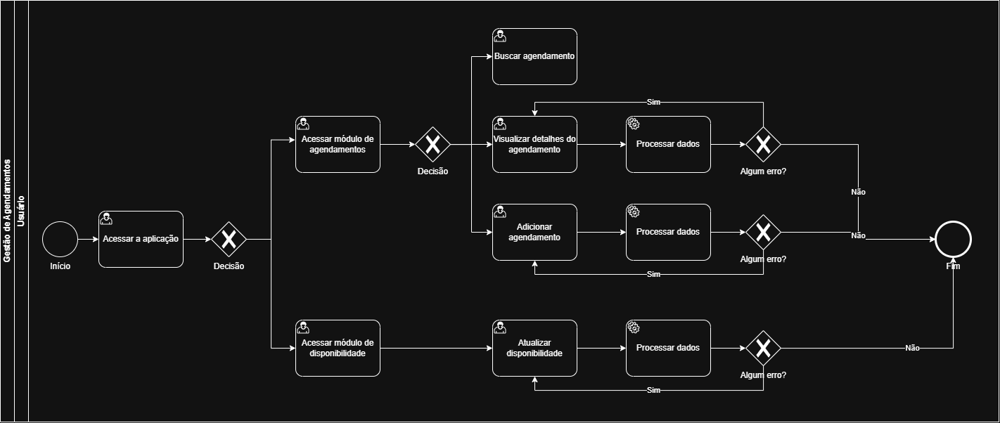

# 3.3.3 Processo 3 – GESTÃO DE AGENDAMENTO

O processo de **Gestão de Agendamento** permite que administradores, colaboradores e clientes visualizem e gerenciem agendamentos de serviços, cada um com visibilidade adequada ao seu perfil. Além disso, cada colaborador possui uma agenda de disponibilidade própria, onde pode definir os horários de início e fim de sua jornada de trabalho para cada dia da semana.

## Oportunidades de melhoria

A informatização do processo de Gestão de Agendamento traz as seguintes oportunidades de melhoria:

- Prevenção de conflitos: o sistema impede o cadastro de serviços concomitantes para o mesmo prestador ou recurso, algo impossível no controle manual.
- Organização e visibilidade: a visualização semanal unificada, com filtros e busca, dá a cada perfil exatamente a informação necessária no momento certo.
- Controle de jornada de trabalho: colaboradores podem definir os dias e horários em que estão disponíveis para receber agendamentos de serviços.
- Experiência do cliente: redução de retrabalhos e atrasos, com horários claros e lembretes automáticos (potencial).
- Gestão de recursos: o administrador consegue balancear a carga dos colaboradores e ajustar a oferta de serviços com dados reais de agendamento.

## Modelagem

Em seguida, apresenta-se o modelo do processo de Gestão de Agendamento, descrito no padrão BPMN:

## Processo Gestão de Agendamento

O processo de **Gestão de Agendamento** ocorre em duas modalidades distintas. A primeira, relacionada ao agendamento de serviços, se inicia com o usuário acessando a tela de módulo de agendamentos em que se apresenta um calendário com a relação de todos os agendamentos no sistema. A partir desta tela, o usuário pode buscar um agendamento, adicionar um novo agendamento, selecionar um agendamento existente para edição ou para exclusão conforme opções mostradas a seguir.

- Buscar agendamento: Ele pode utilizar o campo "Buscar agendamentos" para filtrar um nome de serviço no calendário e apagar a digitação do campo para retornar ao status nativo do calendário. 
- Adicionar agendamento: Ao clicar no botão "Adicionar", abre-se o modal "Novo agendamento", onde ele seleciona o "Serviço", "Cliente", "Colaborador", preenche "Data", "Horário" e "Desconto" e então pode utilizar o botão "Cadastrar" para adicionar o agendamento ou o botão "Cancelar" ou "X" para cancelar a operação. 
- Visualizar detalhes do agendamento: Ao clicar no card do agendamento no calendário, um modal é aberto com os dados atuais preenchidos para alteração, em que o usuário pode alterar confirmando a ação no botão "Salvar", cancelar a operação no botão "Cancelar" ou "X" ou ainda excluir o agendamento no botão "Excluir".

Após cada uma dessas opções, o fluxo de agendamento de serviços é finalizado.

Já a segunda modalidade, relacionada à agenda de disponibilidade de colaboradores, se inicia com o colaborador ou o administrador acessando a tela de módulo de disponibilidade. Nessa tela são apresentados os dias da semana e o usuário pode alterar a disponibilidade de um dia da semana ou ajustar o horário da sua jornada de trabalho em um dia, conforme as opções mostradas a seguir. Qualquer alteração em um determinado dia recebera um indicador visual mostrando que as atualizações ainda não foram salvas. A tela também mostra um resumo da disponibilidade dos dias da semana para uma melhor visualização.

- Salvar alterações: Ao clicar no botão, todas as alterações pendentes são salvas. O botão permanece inativo enquanto não houver modificação na disponibilidade do colaborador.
- Alterar disponibilidade: Ao clicar no botão de estilo *toggle* o está de disponibilidade vai variar entre Disponível e Indisponível. O estado Disponível possui uma interface colorida e permite a alteração dos campos Início e Fim, enquanto o estado Indispoível possui uma interface sem cores e torna os botões Início e Fim indisponíveis.
- Alterar hora início: O usuário pode definir uma nova hora de início para a sua jornada de trabalho.
- Alterar hora fim: O usuário pode definir uma nova hora de fim para a sua jornada de trabalho.

### Detalhamento das atividades
 
#### Acessar módulo de agendamentos
 
| **Campo**               | **Tipo**  | **Restrições**  | **Valor padrão**                  |
| ----------------------- | --------- | --------------- | --------------------------------- |
| Buscar agendamentoss      | Caixa de texto | vazio | vazio                     |
 
| **Comandos**            | **Destino**                                      | **Tipo** |
| ----------------------- | ------------------------------------------------ | -------- |
| Semana anterior (<)     | Atividade "Acessar módulo de agendamentos"      | padrão   |
| Próxima semana (>)      | Atividade "Acessar módulo de agendamentos"      | padrão   |
| Card agendamento   | Atividade "Visualizar detalhes do agendamento"   | padrão   |
| + Adicionar             | Atividade "Adicionar agendamento"                    | padrão   |
 
| **Resultado**           | **Destino**                                      |
| ----------------------- | ------------------------------------------------ |
| Semana alterada         | Calendário atualizado para a semana selecionada  |
| Agendamento selecionado | Atividade "Visualizar detalhes do agendamento"   |
| Novo agendamento        | Atividade "Adicionar agendamento"                    |

## Wireframes

**Acessar módulo de agendamentos**

")

#### Buscar agendamentos

| **Campo**         | **Tipo**       | **Restrições**                        | **Valor padrão** |
| ----------------- | -------------- | ------------------------------------- | ---------------- |
| Buscar agendamentos          | Caixa de texto | vazio  | vazio            |

| **Resultado**             | **Destino**                                      |
| ------------------------- | ------------------------------------------------ |
| Agendamento encontrado       | Calendário filtrada pelo termo digitado            |
| Nenhum resultado          | Calendário vazio                                   |
| Busca apagada             | Retorno ao calendário completo                     |
 
---
 
#### Adicionar agendamento
 
| **Campo**               | **Tipo**       | **Restrições**             | **Valor padrão** |
| ----------------------- | -------------- | -------------------------- | ---------------- |
| Serviço         | Seleção única | obrigatório                | vazio            |
| Cliente                 | Seleção única  | obrigatório                | vazio            |
| Colaborador               | Seleção única  | obrigatório                | vazio            |
| Data                    | Data           | obrigatório; formato válido | vazio           |
| Horário      | Hora           | obrigatório; formato válido | vazio           |
| Desconto (R$)                   | Numérico       | obrigatório; valor ≥ 0     | R$ 0,00          |
 
| **Comandos**  | **Destino**                                           | **Tipo** |
| ------------- | ----------------------------------------------------- | -------- |
| Cadastrar     | Atividade "Acessar módulo de agendamentos"           | padrão   |
| Cancelar      | Atividade "Acessar módulo de agendamentos"           | cancelar |
 
| **Resultado**           | **Destino**                                           |
| ----------------------- | ----------------------------------------------------- |
| Agendamento criado      | Toast de sucesso e Atividade "Acessar módulo de agendamentos" |
| Prompt de erro          | "Campo inválido."                                     |
| Operação cancelada      | Atividade "Acessar módulo de agendamentos"           |

## Wireframes

**Adicionar Agendamento**

")
 
---
 
#### Visualizar detalhes do agendamento
 
| **Campo**               | **Tipo**       | **Restrições**             | **Valor padrão** |
| ----------------------- | -------------- | -------------------------- | ---------------- |
| Serviço         | Seleção única | obrigatório                | dado atual            |
| Cliente                 | Seleção única  | obrigatório                | dado atual            |
| Colaborador               | Seleção única  | obrigatório                | dado atual           |
| Data                    | Data           | obrigatório; formato válido | dado atual         |
| Horário      | Hora           | obrigatório; formato válido | dado atual         |
| Desconto (R$)                   | Numérico       | obrigatório; valor ≥ 0     | dado atual        |
 
| **Comandos**  | **Destino**                                           | **Tipo** |
| ------------- | ----------------------------------------------------- | -------- |
| Salvar        | Atividade "Acessar módulo de agendamentos"                        | padrão   |
| Excluir       | Atividade "Acessar módulo de agendamentos"                       | destrutivo   |
| Cancelar    | Atividade "Acessar módulo de agendamentos"           | cancelar |
| X (fechar)    | Atividade "Acessar módulo de agendamentos"           | cancelar |
 
| **Resultado**           | **Destino**                                           |
| ----------------------- | ----------------------------------------------------- |
| Agendamento alterado  | Toast de sucesso e Atividade "Acessar módulo de agendamentos"                        |
| Agendamento excluído | Toast de sucesso e Atividade "Acessar módulo de agendamentos"                      |
| Operação cancelada           | Atividade "Acessar módulo de agendamentos"           |

## Wireframes

**Detalhes do agendamento**

")

---
 
#### Acessar módulo de disponibilidade
 
| **Campo**               | **Tipo**  | **Restrições**  | **Valor padrão**                  |
| ----------------------- | --------- | --------------- | --------------------------------- |
| Início      | Caixa de texto | menor que Fim | valor atual                     |
| Fim      | Caixa de texto | maior que Início | valor atual                     |
 
| **Comandos**            | **Destino**                                      | **Tipo** |
| ----------------------- | ------------------------------------------------ | -------- |
| Salvar alterações      | Atividade "Salvar alterações"      | padrão   |
| Disponibilidade (*toggle*)     | Atividade "Alterar disponibilidade"      | valor atual   |
 
| **Resultado**           | **Destino**                                      |
| ----------------------- | ------------------------------------------------ |
| Salvar alterações         | Toast de sucesso e Atividade "Acessar módulo de disponibilidade"  |

## Wireframes

**Acessar módulo de disponibilidade**

")
