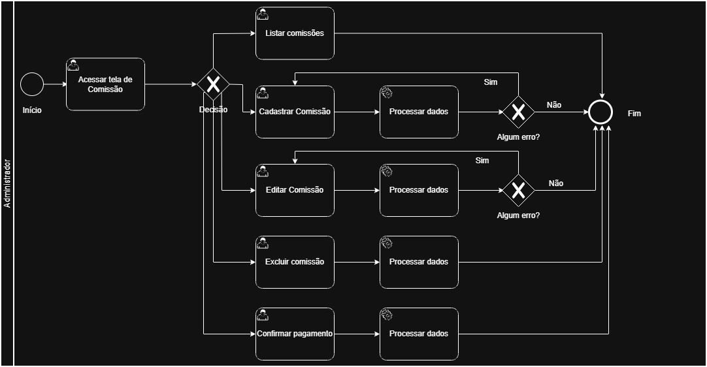
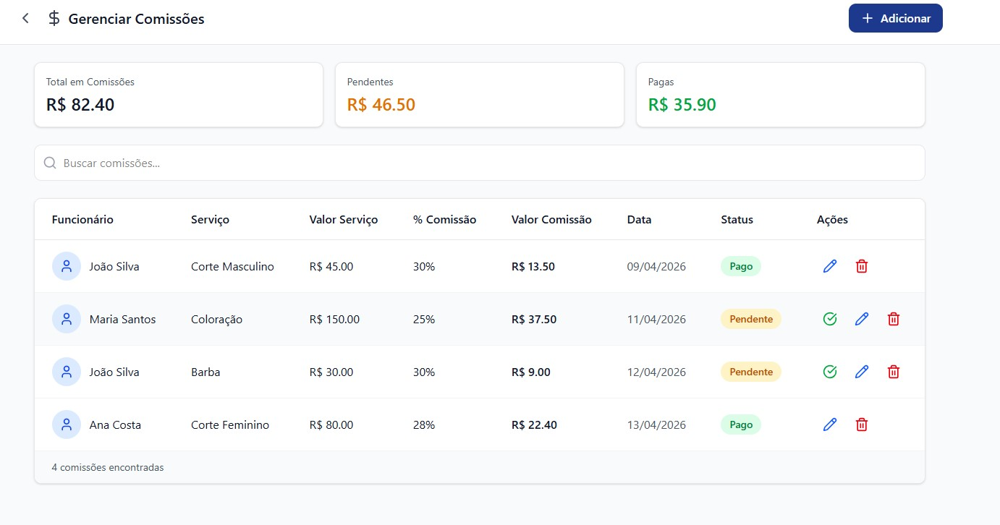
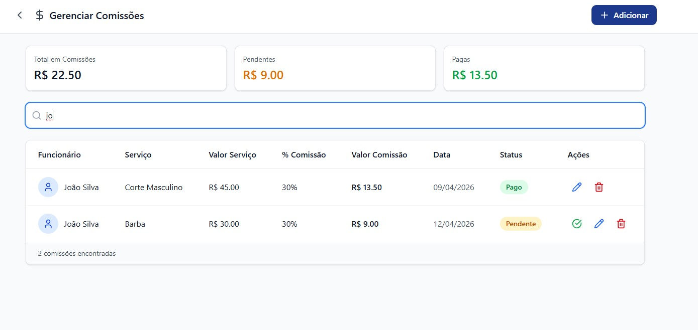
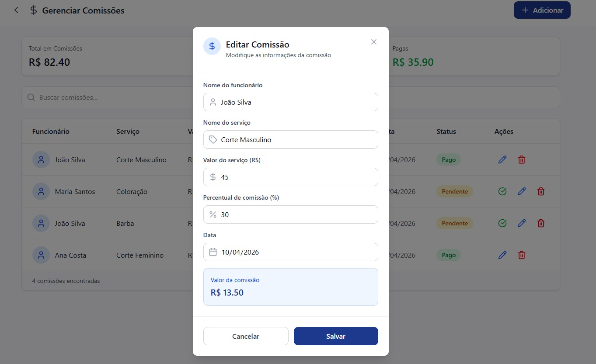
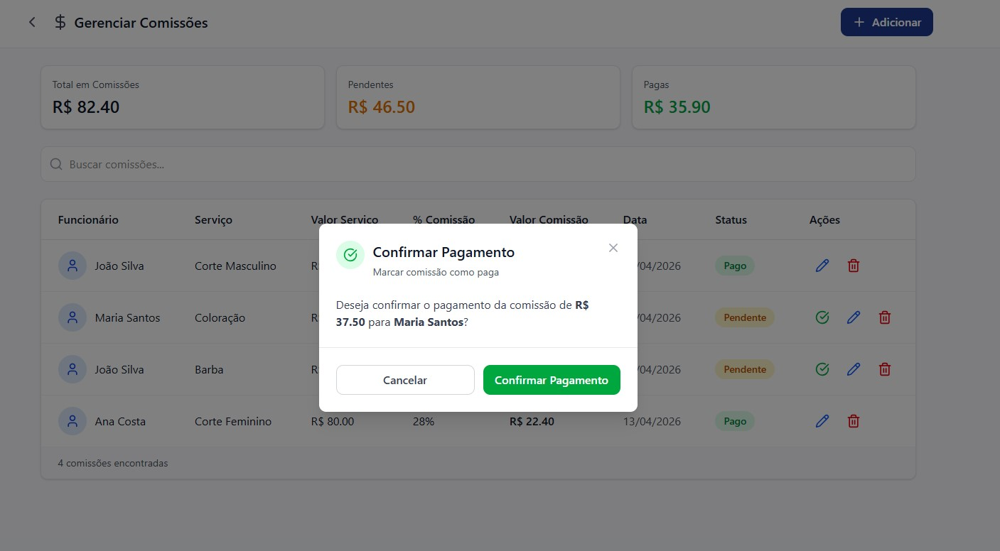

# 3.3.4 Processo 4 – GESTÃO DE COMISSÃO

O processo de **Gestão de Comissão** tem como objetivo permitir que o usuário visualize e edite comissões dentro do sistema. Inicialmente, o sistema apresenta a listagem das comissões existentes, permitindo ao usuário visualizar os registros disponíveis. A partir dessa visualização, o usuário pode decidir realizar uma das ações disponíveis.

Após a execução de qualquer uma dessas ações, o sistema retorna à listagem atualizada de comissões. O usuário pode repetir o ciclo de gerenciamento quantas vezes desejar até decidir finalizar o processo(ir para outra tela ou sair do software).

## Oportunidades de melhoria

A informatização do processo de Gestão de Comissão traz as seguintes oportunidades de melhoria:

• Implementação de **validações automáticas** para evitar cadastro de comissões duplicadas.

• Configuração de regras automáticas: cálculo automático de comissão (percentual por serviço e faixa de valor) reduzindo erros manuais.

• Inclusão de **confirmação antes da exclusão** de uma comissão.

• Possibilidade de **filtros e busca na listagem de comissões** para facilitar a navegação.

• Registro de **histórico de alterações** para auditoria.

• Feedback visual ao usuário após operações de cadastro, edição ou exclusão.

• Integração com dashboards financeiros e/ou relatórios.

## Modelagem

Em seguida, apresenta-se o modelo do processo de Gestão de Comissão, descrito no padrão BPMN:

## Processo Gestão de Comissão

O processo de **Gestão de Comissão** tem como objetivo permitir que o administrador visualize, edite e confirme o pagamento das comissões dos funcionários. O processo se inicia com o administrador acessando a tela de Comissão em que se apresente a listagem de todas as comissões cadastradas no sistema. A partir desta tela, o administrador pode buscar uma comissão, adicionar uma nova comissão, selecionar uma comissão existente para edição, selecionar uma comissão existente para confirmação de pagamento ou selecionar uma comissão existente para exclusão conforme opções mostradas a seguir.

- Listar comissões: Ele pode utilizar o campo "Buscar comissões" digitando um nome de funcionário na lista para retonar a listagem filtrada e apagar a digitação do campo para retornar retornar à listagem completa.
- Editar comissão: Ao clicar no ícone de lápis (na coluna Ações), um modal é aberto com os dados atuais preenchidos para alteração, em que o usuário pode alterar os campos desejados e clicar em "Salvar"para confirmar as alterações ou cancelar a operação no botão "Cancelar" ou "X" para fechar o modal sem salvar.
- Confirmar pagamento: Ao clicar no ícone de check em verde, o sistema exibe um modal de confirmação, em que o administrador pode clicar em "Confirmar Pagamento" para marcar a comissão como paga ou cancelar a operação no botão "Cancelar" ou "X" para fechar o modal sem alterar o status.
  
### Detalhamento das atividades

#### Acessar tela de Comissão

| **Campo**           | **Tipo** | **Restrições**  | **Valor padrão**             |
| ------------------- | -------- | --------------- | ---------------------------- |
| Buscar comissões    | Caixa de texto | vazio     | vazio                        |

| **Comandos**              | **Destino**                                      | **Tipo** |
| ------------------------- | ------------------------------------------------ | -------- |
| Editar Comissão (lápis)            | Atividade "Editar comissão"             | padrão   |
| Confirmar pagamento (✓)   | Atividade "Confirmar pagamento"                  | padrão   |

| **Resultado**             | **Destino**                                      |
| ------------------------- | ------------------------------------------------ |
| Comissão encontrada       | Listagem filtrada pelo termo digitado            |
| Modal de edição aberto    | Atividade "Editar comissão"                      |
| Modal de pagamento aberto | Atividade "Confirmar pagamento"                  |

## Wireframe

#### Acessar tela de Comissão

### Detalhamento das atividades

#### Listar comissões

| **Campo**           | **Tipo** | **Restrições**  | **Valor padrão**             |
| ------------------- | -------- | --------------- | ---------------------------- |
| Buscar comissões    | Caixa de texto | vazio     | vazio                        |

| **Resultado**             | **Destino**                                      |
| ------------------------- | ------------------------------------------------ |
| Comissão encontrada       | Listagem filtrada pelo termo digitado            |
| Nenhum resultado          | Listagem vazia                                   |
| Busca apagada             | Retorno à listagem completa                      |

#### Listar comissões

---

#### Editar Comissão

| **Campo**                   | **Tipo**       | **Restrições**              | **Valor padrão**   |
| --------------------------- | -------------- | --------------------------- | ------------------ |
| Nome do funcionário         | Caixa de texto | obrigatório                 | atual preenchido   |
| Nome do serviço             | Caixa de texto | obrigatório                 | atual preenchido   |
| Valor do serviço (R$)       | Numérico       | obrigatório; valor ≥ 0      | atual preenchido   |
| Percentual de comissão (%)  | Numérico       | obrigatório; valor entre 0 e 100 | atual preenchido |
| Data                        | Data           | obrigatório; formato válido | atual preenchido   |

| **Comandos** | **Destino**                                           | **Tipo** |
| ------------ | ----------------------------------------------------- | -------- |
| Salvar       | Atividade "Acessar tela de Comissão"              | padrão   |
| Cancelar     | Atividade "Acessar tela de Comissão"              | cancelar |
| X (fechar)   | Atividade "Acessar tela de Comissão"              | cancelar |

| **Resultado**          | **Destino**                                                        |
| ---------------------- | ------------------------------------------------------------------ |
| Comissão alterada      | Toast de sucesso e Atividade "Acessar tela de Comissão"        |
| Prompt de erro         | "Não foi possível salvar alteração. Tente novamente."              |
| Operação cancelada     | Atividade "Acessar tela de Comissão"                           |

## Wireframe

#### Editar Comissão

---

#### Confirmar pagamento

| **Comandos**          | **Destino**                                           | **Tipo** |
| --------------------- | ----------------------------------------------------- | -------- |
| Confirmar Pagamento   | Atividade "Acessar tela de Comissão"              | padrão   |
| Cancelar              | Atividade "Acessar tela de Comissão"              | cancelar |
| X (fechar)            | Atividade "Acessar tela de Comissão"              | cancelar |

| **Resultado**          | **Destino**                                                        |
| ---------------------- | ------------------------------------------------------------------ |
| Pagamento confirmado   | Toast de sucesso e Atividade "Acessar tela de Comissão"        |
| Operação cancelada     | Atividade "Acessar tela de Comissão"                           |

## Wireframe

#### Confirmar pagamento

