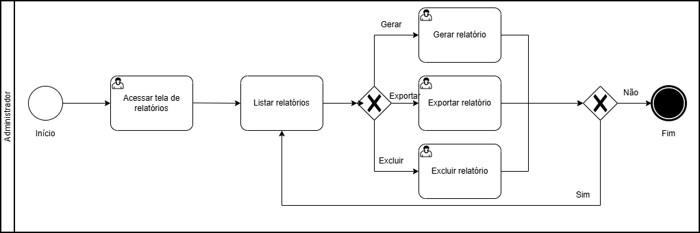
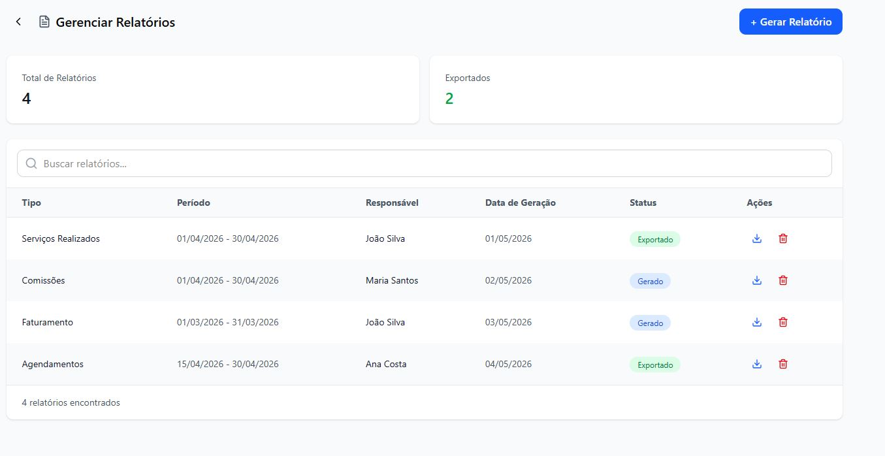
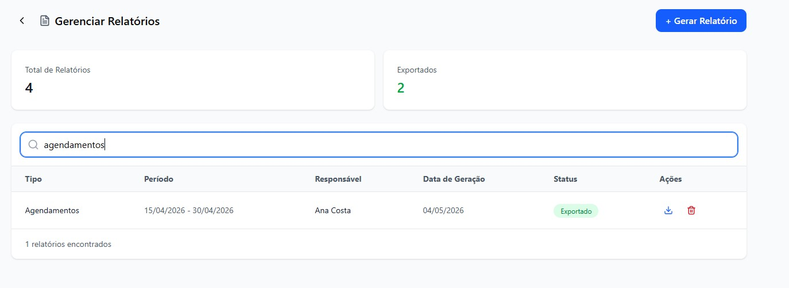
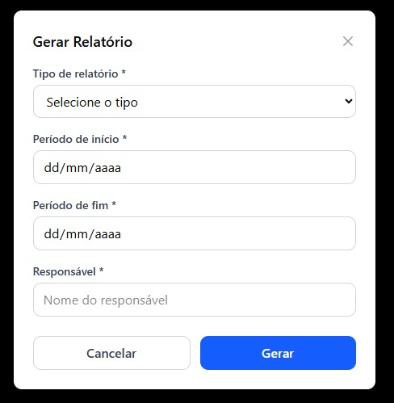
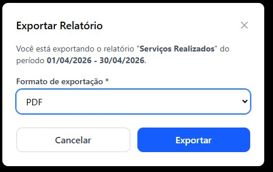
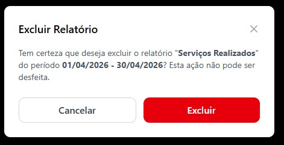

# 3.3.5 Processo 5 – GESTÃO DE RELATÓRIO

O processo de **Gestão de Relatório** tem como objetivo permitir que o administrador visualize, gere, filtre e exporte relatórios dentro do sistema.

## Oportunidades de melhoria
 
A informatização do processo de Gestão de Relatório traz as seguintes oportunidades de melhoria:
 
• Implementação de filtros avançados por período, tipo de relatório, responsável e status, facilitando a busca por registros específicos.
 
• Geração automática de relatórios periódicos com base em configurações predefinidas, reduzindo a necessidade de geração manual.
 
• Inclusão de confirmação antes da exclusão de um relatório gerado.
 
• Possibilidade de exportação em múltiplos formatos (PDF, Excel, CSV) para facilitar o compartilhamento e análise dos dados.
 
• Registro de histórico de acesso e geração para fins de auditoria.
 
• Feedback visual ao usuário após operações de geração ou exportação de relatórios.
 
• Integração com dashboards analíticos para visualização gráfica dos dados dos relatórios.
 
## Modelagem
 
Em seguida, apresenta-se o modelo do processo de Gestão de Relatório, descrito no padrão BPMN:
 
O processo de **Gerenciamento de Relatório** tem como objetivo permitir que o administrador visualize, gere, filtre e exporte relatórios do sistema. O processo se inicia com o administrador acessando a página de Gerenciamento de Relatórios, onde são exibidos dois cards de resumo com os valores de total de relatórios gerados e relatórios exportados, além de uma listagem de todos os relatórios com as colunas: tipo, período, responsável, data de geração, status e ações.
 
- Caso o administrador queira buscar um relatório, ele digita um termo na barra de pesquisa e a listagem é filtrada de acordo com o tipo ou responsável digitado, exibindo os resultados encontrados. O administrador pode apagar a digitação para retornar à listagem completa.
- Caso o administrador queira gerar um novo relatório, ele pressiona o botão "+ Gerar Relatório" e um modal é aberto com campos para preencher: tipo de relatório, período de início, período de fim e responsável. Após preencher os campos, o administrador clica em "Gerar" para confirmar a geração ou em "Cancelar" para fechar o modal sem salvar.
- Caso o administrador queira exportar um relatório, ele clica no ícone de exportação na linha correspondente e um modal de confirmação é exibido informando o tipo e o período do relatório. O administrador pode selecionar o formato de exportação (PDF, Excel ou CSV) e clicar em "Exportar" para confirmar ou em "Cancelar" para fechar o modal sem exportar.
- Caso o administrador queira excluir um relatório, ele clica no ícone de lixeira na linha correspondente e um modal de confirmação é exibido informando o tipo e o período do relatório a ser excluído. O administrador pode clicar em "Excluir" para confirmar a exclusão ou em "Cancelar" para fechar o modal sem excluir.

### Detalhamento das atividades
 
#### Acessar tela de relatórios
 
| **Campo**           | **Tipo**       | **Restrições** | **Valor padrão** |
| ------------------- | -------------- | -------------- | ---------------- |
| Buscar relatórios   | Caixa de texto | vazio          | vazio            |
 
| **Comandos**              | **Destino**                                        | **Tipo** |
| ------------------------- | -------------------------------------------------- | -------- |
| + Gerar Relatório         | Atividade "Gerar relatório"                        | padrão   |
| Exportar (ícone)          | Atividade "Exportar relatório"                     | padrão   |
| Excluir (lixeira)         | Atividade "Excluir relatório"                      | padrão   |
 
| **Resultado**                | **Destino**                                        |
| ---------------------------- | -------------------------------------------------- |
| Relatório encontrado         | Listagem filtrada pelo termo digitado              |
| Nenhum resultado             | Listagem vazia                                     |
| Busca apagada                | Retorno à listagem completa                        |
| Modal de geração aberto      | Atividade "Gerar relatório"                        |
| Modal de exportação aberto   | Atividade "Exportar relatório"                     |
| Modal de exclusão aberto     | Atividade "Excluir relatório"                      |
 
## Wireframe
 
#### Acessar tela de relatórios
 

 
#### Listar relatórios
 

 
---
 
#### Gerar relatório
 
| **Campo**              | **Tipo**       | **Restrições**              | **Valor padrão** |
| ---------------------- | -------------- | --------------------------- | ---------------- |
| Tipo de relatório      | Lista          | obrigatório                 | vazio            |
| Período de início      | Data           | obrigatório; formato válido | vazio            |
| Período de fim         | Data           | obrigatório; formato válido; ≥ período de início | vazio |
| Responsável            | Caixa de texto | obrigatório                 | vazio            |
 
| **Comandos** | **Destino**                                            | **Tipo** |
| ------------ | ------------------------------------------------------ | -------- |
| Gerar        | Atividade "Acessar a lista de relatórios"              | padrão   |
| Cancelar     | Atividade "Acessar a lista de relatórios"              | cancelar |
| X (fechar)   | Atividade "Acessar a lista de relatórios"              | cancelar |
 
| **Resultado**          | **Destino**                                                           |
| ---------------------- | --------------------------------------------------------------------- |
| Relatório gerado       | Toast de sucesso e Atividade "Acessar a lista de relatórios"          |
| Prompt de erro         | "Campo inválido."                                                     |
| Operação cancelada     | Atividade "Acessar a lista de relatórios"                             |
 
## Wireframe
 
#### Gerar relatório
 

 
---
 
#### Exportar relatório
 
| **Campo**              | **Tipo** | **Restrições**              | **Valor padrão** |
| ---------------------- | -------- | --------------------------- | ---------------- |
| Formato de exportação  | Lista    | obrigatório; PDF, Excel ou CSV | PDF           |
 
| **Comandos** | **Destino**                                            | **Tipo** |
| ------------ | ------------------------------------------------------ | -------- |
| Exportar     | Atividade "Acessar a lista de relatórios"              | padrão   |
| Cancelar     | Atividade "Acessar a lista de relatórios"              | cancelar |
| X (fechar)   | Atividade "Acessar a lista de relatórios"              | cancelar |
 
| **Resultado**          | **Destino**                                                           |
| ---------------------- | --------------------------------------------------------------------- |
| Relatório exportado    | Download iniciado e Atividade "Acessar a lista de relatórios"         |
| Prompt de erro         | "Não foi possível exportar o relatório. Tente novamente."             |
| Operação cancelada     | Atividade "Acessar a lista de relatórios"                             |
 
## Wireframe
 
#### Exportar relatório
 

 
---
 
#### Excluir relatório
 
| **Comandos** | **Destino**                                            | **Tipo** |
| ------------ | ------------------------------------------------------ | -------- |
| Excluir      | Atividade "Acessar a lista de relatórios"              | padrão   |
| Cancelar     | Atividade "Acessar a lista de relatórios"              | cancelar |
| X (fechar)   | Atividade "Acessar a lista de relatórios"              | cancelar |
 
| **Resultado**          | **Destino**                                                           |
| ---------------------- | --------------------------------------------------------------------- |
| Relatório excluído     | Toast de sucesso e Atividade "Acessar a lista de relatórios"          |
| Operação cancelada     | Atividade "Acessar a lista de relatórios"                             |
 
## Wireframe
 
#### Excluir relatório
 

