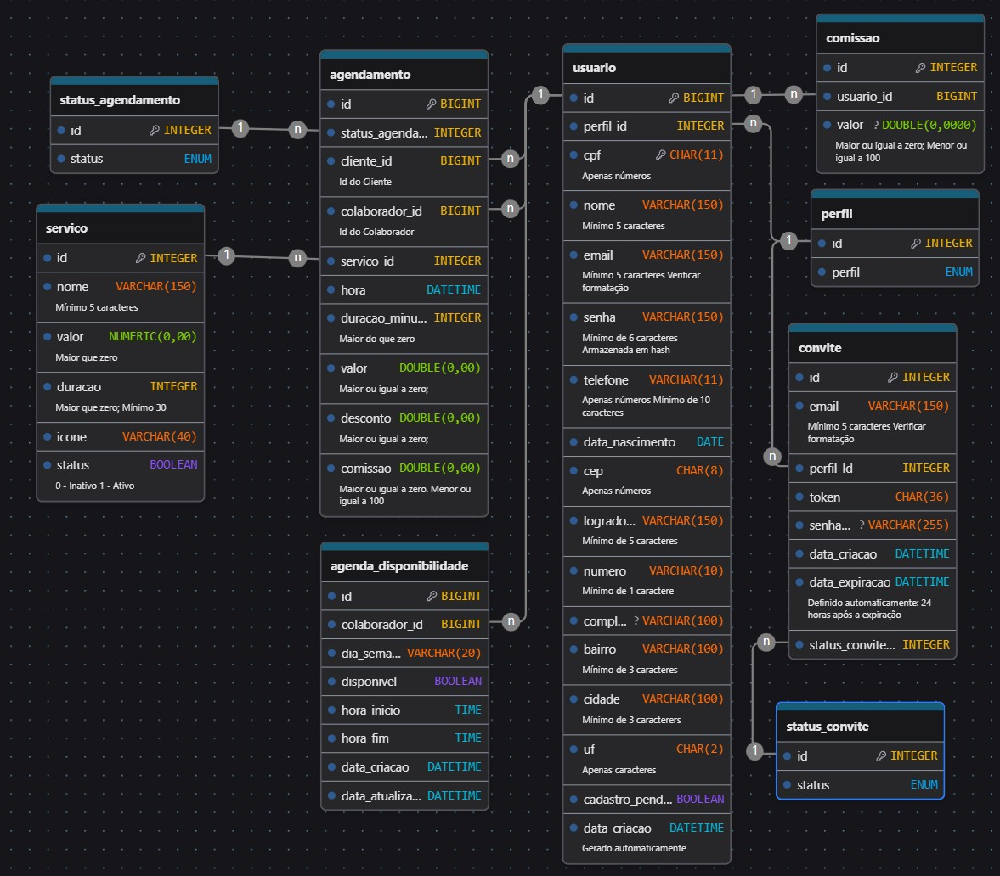

## 4. Projeto da solução

### 4.1. Modelo de dados

O modelo relacional Servify conta com 5 tabelas.
- A tabela **usuario** permite armazenar usuários e distinguir entre os diferentes perfis existentes na plataforma
- A tabela **comissao** permite armazenar o valor de comissão que um colaborador recebe por um serviço prestado
- A tabela **servico** permite armazenar diferentes serviços que o estabelecimente oferece
- A tabela **agendamento** permite armazenar um agendamento de um serviço e serve de base para o cálculo do valor faturado pelo estabelecimento e do valor de comissão devida ao colaborador que prestou o serviço
- A tabela **perfil** permite armazenar os tipos de perfís de acesso disponíveis na aplicação
- A tabela **status_agendamento** permite armazenar os tipos de *status* que um agendamento pode possuir ao longo do seu ciclo de vida

---

### 4.2. Tecnologias

| **Dimensão**   | **Tecnologia**    |
| ---            | ---               |
| SGBD           | PostgreSQL        |
| IDE            | Visual Studio Code |
| Front end      | Bibliotecas React e jQuery com as linguagens HTML, CSS, JavaScript e TypeScript |
| Back end       | Framework SpringBoot com a linguagem Java   |
| Deploy         | Github Pages      |

